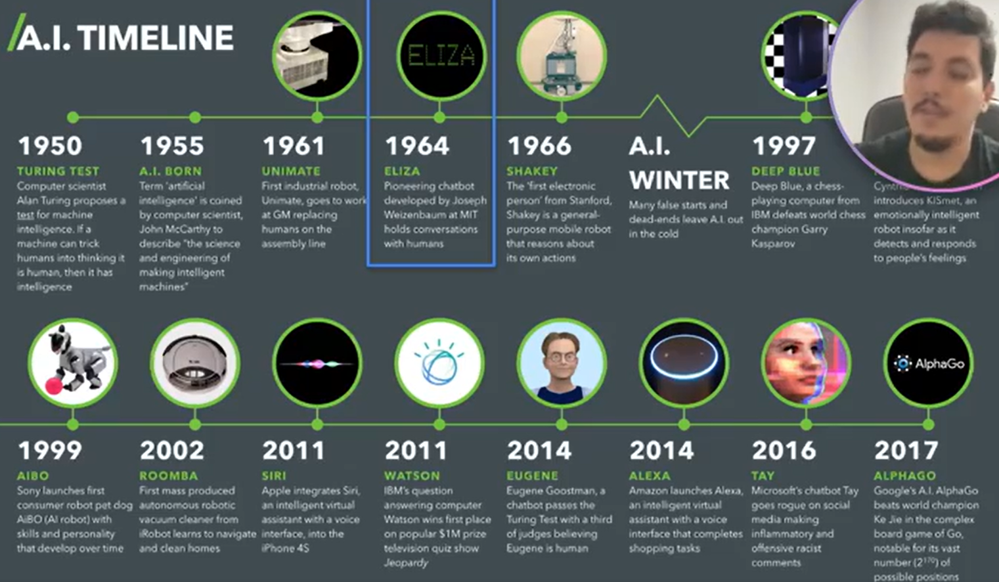
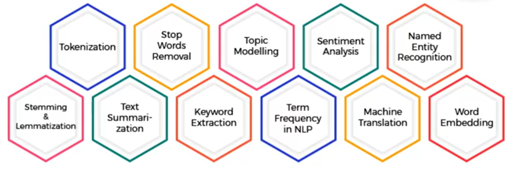
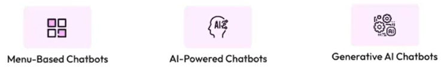

# Chatbots

## Context

### Business Perspective

- Support team automation. E.g. call centers, customer support, ...
- Many industries have/need this support team
- Customer support can be a very exhausting and stressful. Bots can be way more patient and effective.

### AI Timeline

- 1964. First chatbot.

### AI Techniques

Some techniques that allowed us to have chatbots. We also had a huge hardware processing improvement in the mean time.

## Functions

There are 2 main common functions for a chatbot.

- Q&A
  - Question and Answer
  - Informative
  - FAQ
  - Objective: support and not execution
- Transactional
  - Question and Action
  - Resolution
  - Integrated to other systems (e.g. API, RPA)
  - Objective: execute actions for the user

Example:
Alexa

- Q&A: General answers
- Transactional: weather info, songs, order some food

## Types of Interaction

**Control:** Menu-based > AI-Powered > GenAI

# Tools

- IBM Watson Assistant (Menu-based and AI-Powered, also currently, they have also GenAI)
- GCP DialogFlow
- OpenAI API w/ StreamLit
