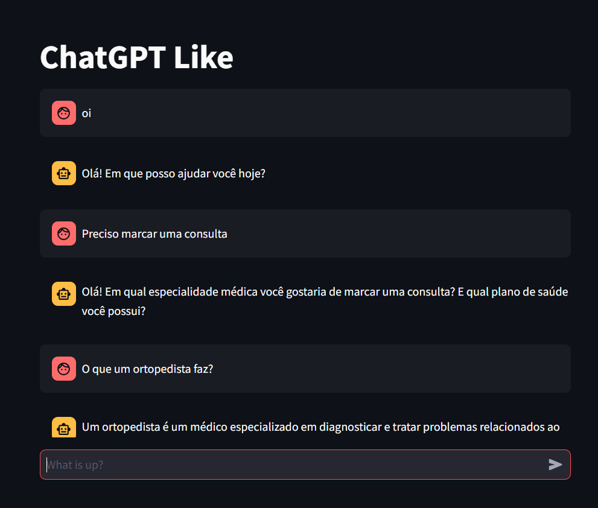

# How to run

```sh
# venv & install deps
source .venv/bin/activate
pip install -r requirements.txt

# set your OPENAI_API_KEY on .streamlit/secrets.toml

# start app
streamlit run streamLitGPT.py
```

# Preview


